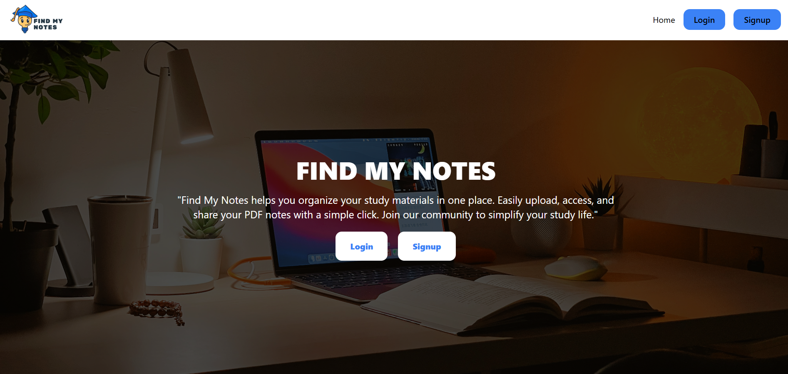
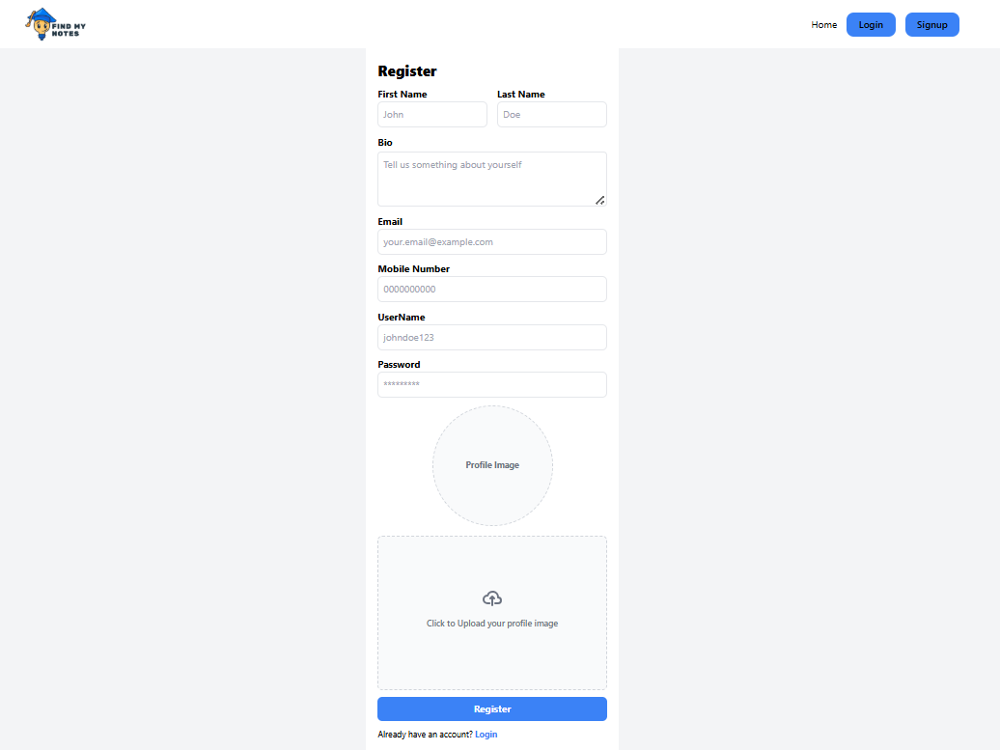
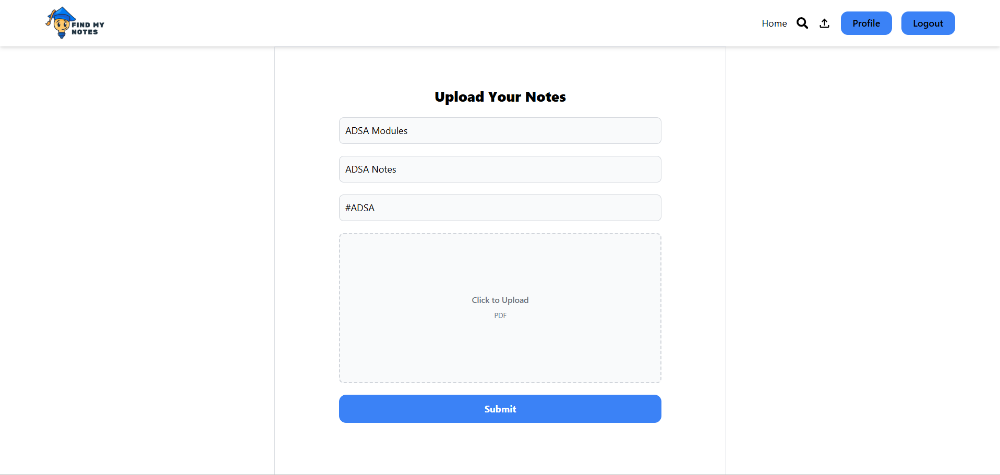
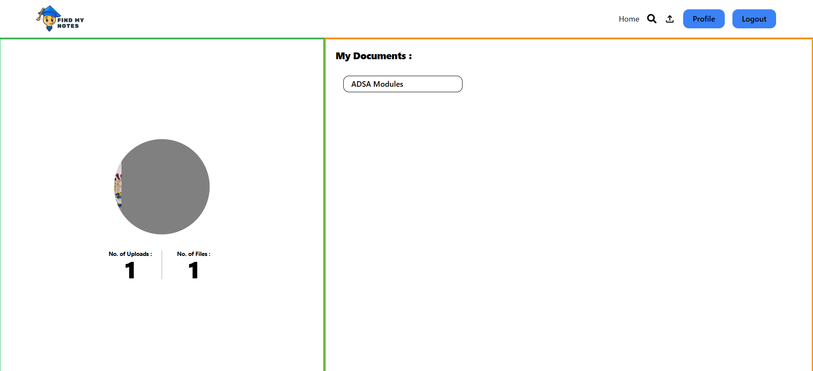
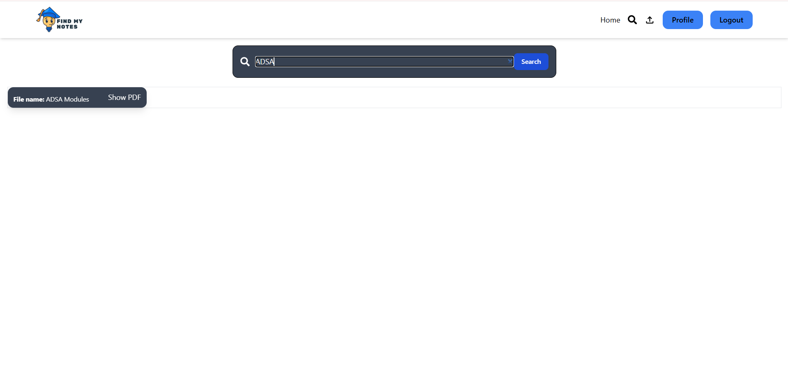

# 📚 FindMyNotes

FindMyNotes is a full-stack web application that helps users upload, manage, search, and organize their study notes in one place.

---

## 🚀 Features

* 🔐 User Authentication (Signup & Login)
* 🖼️ Profile Image Upload (Cloudinary)
* 📄 Upload Notes (PDF)
* 🔍 Search Notes by Title & Tags
* 📁 Personal Dashboard (Profile Page)
* ☁️ MongoDB Atlas Database
* ⚡ Fast Frontend with React + Vite

---

## 🛠️ Tech Stack

### Frontend

* React.js
* Redux Toolkit
* Tailwind CSS
* Axios

### Backend

* Node.js
* Express.js
* MongoDB (Atlas)
* Mongoose
* Multer (File Upload)
* Cloudinary (Image Storage)
* Bcrypt (Password Hashing)

---

## 📂 Project Structure

```
FindMyNotes/
│
├── client/          # Frontend (React)
│   └── src/
│
├── server/          # Backend (Node + Express)
│   ├── Controllers/
│   ├── Models/
│   ├── Routes/
│   ├── files/       # Uploaded PDFs
│   ├── images/      # Uploaded Images
│   └── index.js
│
└── README.md
```

---

## ⚙️ Installation & Setup

### 🔹 Clone the repository

```bash
git clone https://github.com/vinayphanse888/FindMyNotes
cd FindMyNotes
```

---

### 🔹 Backend Setup

```bash
cd server
npm install
nodemon index.js
```

---

### 🔹 Frontend Setup

```bash
cd client
npm install
npm run dev
```

---

## 🔐 Environment Variables (.env)

Create `.env` file inside **server/** folder:

```env
MONGO_URI=your_mongodb_connection_string
PORT=6969

CLOUDINARY_NAME=your_cloud_name
CLOUDINARY_API_KEY=your_api_key
CLOUDINARY_API_SECRET=your_api_secret
```

---

## 📸 Screenshots

### 🏠 Home Page



### 🔐 Signup Page



### 📤 Upload Notes



### 👤 Profile Page



### 🔍 Search Notes



---

## 📌 How It Works

1. User signs up and uploads profile image
2. Image is stored on **Cloudinary**
3. User uploads notes (PDF files)
4. Files are stored in server `/files` folder
5. Metadata is saved in MongoDB
6. Users can search and view notes anytime

---

## 🔥 Future Improvements

* ⭐ Download Notes Feature
* ⭐ Like / Save Notes
* ⭐ Public Notes Sharing
* ⭐ Dark Mode
* ⭐ JWT Authentication

---

## 👨‍💻 Author

**Vinay Phanse**

---
